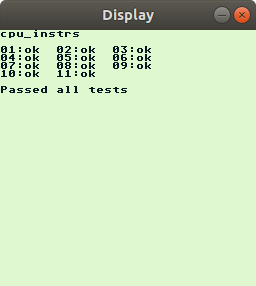

# gbemulator

This is a simple GB emulator written in C++. The CPU emulation is extensively
unit-tested.

## Features

- [x] Runs basic games
- [x] Passes all of [Blargg's](https://gbdev.gg8.se/wiki/articles/Test_ROMs) CPU
instruction tests
- [ ] ESP32 port (in development)
- [ ] Input handling

## Screenshots



## How to clone

Clone the repository recursively to get the submodules:
```
git clone --recurse-submodules https://github.com/narfg/gbemulator
```
If you have already cloned the repository and forgot the `--recurse-submodules`
flag you can initialize the submodules with the following command:
```
git submodule update --init
```

## How to build

The project uses the [CMake](https://cmake.org/) build system and can be built
like most CMake-based projects.
```
mkdir build
cd build/
cmake ..
make
make test
```

## How to run

```
cd build/
./emulator rom.gb
```

## Dependencies

* [Catch2](https://github.com/catchorg/Catch2): Unit testing framework
(used as a submodule)
* [MiniFB](https://github.com/emoon/minifb): Frame buffer library
(used as a submodule)

On a fresh installation of Ubuntu 18.04 you will need the following packages:
```
sudo apt install cmake g++ git libx11-dev
```
